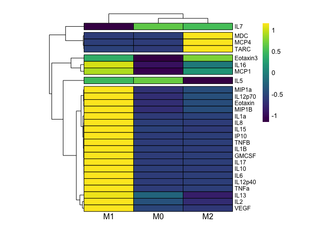
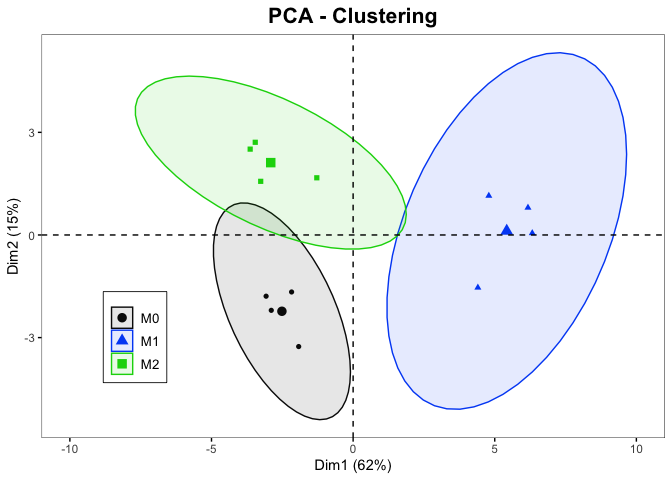
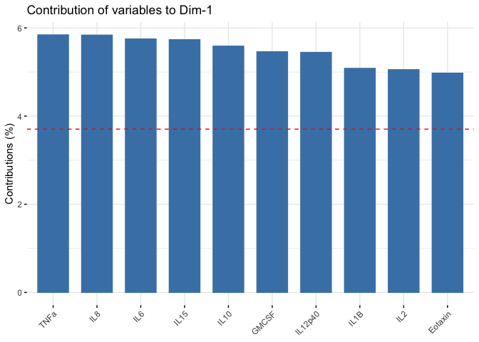
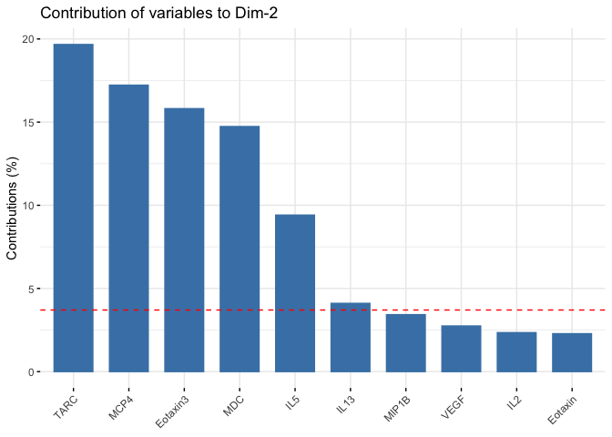
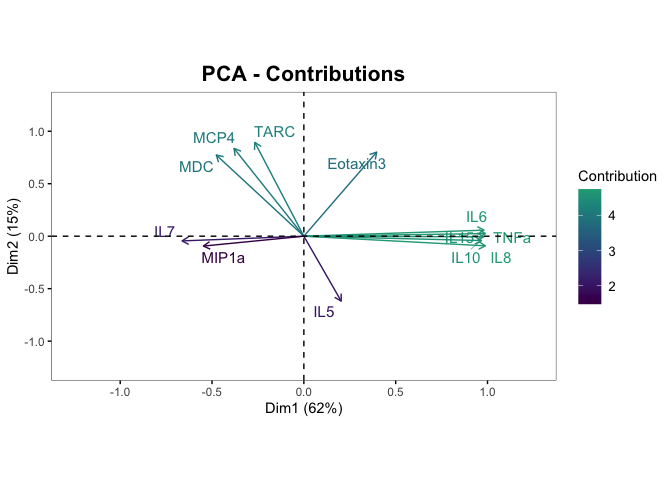

hMDM Cytokine Analysis Script
================

This repository contains the input file and code for generating figures
associated with the manuscript “Expanded functional characterization of
M0, M1, and M2 human monocyte-derived macrophages supports their utility
as a model for respiratory macrophages.” (Hickman et al). This document
demonstrates the implementation of the provided code.

### Setup

``` r
rm(list = ls(all.names = TRUE)) # clears global environ.
```

``` r
# Load packages
library(tidyverse) # for data cleaning
library(pheatmap) # for making heatmap
library(viridis) # for heatmap color scheme
library(table1) # for making cytokine summary table
library(ggfortify) # for PCA
library(factoextra) # for PCA 
library(ggplot2) # for plotting
```

### Import data

Set up data frame.

``` r
MDMCytokineData <- read.csv("2021_05_20 MSD MDM Table.csv")
MDMCytokineData_df <- data.frame(MDMCytokineData, row.names = MDMCytokineData$Clean.Sample.ID)
MDMCytokineData_df <- MDMCytokineData_df[, 3:30]
head(MDMCytokineData_df)
```

    ##            Polarization   Eotaxin Eotaxin.3    GM.CSF      IL.1a      IL.1B
    ## 09 -M M0             M0  73.13765  50.35757  0.724472  0.7216382   4.940650
    ## 09 -M M1             M1 227.67423 254.01236 34.579131 42.8945021 699.965135
    ## 09 -M M2             M2 114.61832 231.69763  1.104836  0.7539122   5.262752
    ## 10 -M M0.1           M0 111.26737  39.71804  0.284556  0.0000000   3.806760
    ## 10 -M M1.1           M1 232.90029 215.17656  4.597714  2.9125515  25.201529
    ## 10 -M M2.1           M2 104.02290 474.55803  0.000000  0.1959286   1.644189
    ##                 IL.2       IL.5        IL.6      IL.7      IL.8       IL.10
    ## 09 -M M0    5.767291 0.34955494   10.295162 0.6795941  13563.70    9.001689
    ## 09 -M M1   21.334184 0.11760021 1577.675084 0.1729565 193836.18 1551.116137
    ## 09 -M M2    6.874286 0.00000000   23.946124 0.4500595  13600.13    6.206025
    ## 10 -M M0.1  5.443709 0.00000000   21.881253 0.2842019  10079.78    3.871315
    ## 10 -M M1.1 12.943647 0.00000000 2878.051037 0.4613720  69698.76  161.439910
    ## 10 -M M2.1  1.619147 0.01852342    8.806903 0.3818748   4820.02    2.610444
    ##               IL.12p40  IL.12p70    IL.13     IL.15     IL.16      IL.17
    ## 09 -M M0     0.5306457  2.593672 66.36255 0.6812514  23.42209 0.00000000
    ## 09 -M M1   215.8065524 11.875920 95.92448 5.2448710 100.60469 0.52021949
    ## 09 -M M2     0.1910797  7.556198 79.54798 0.3903963  76.02147 0.06066138
    ## 10 -M M0.1   0.2558472  3.713789 60.18063 0.2786521  13.03080 0.00000000
    ## 10 -M M1.1 852.5281525 22.368104 81.56710 4.7720210  27.62352 6.55006229
    ## 10 -M M2.1   0.2742932  2.774457 27.82141 0.4364347  28.93360 0.00000000
    ##                 IP.10    MCP.1      MCP.4       MDC    MIP.1a     MIP.1B
    ## 09 -M M0     142.3214 4112.870   60.66652  500.4348  71.22076   992.5369
    ## 09 -M M1   20662.7037 4087.538  120.88633  786.0179   0.00000 15074.7113
    ## 09 -M M2     253.1501 4279.089 3830.81877 6891.8249 507.54335  4966.4604
    ## 10 -M M0.1   761.2642 4123.776   55.78626  501.1276  79.44316   116.9659
    ## 10 -M M1.1 26846.7563 4242.777  119.79747 1269.2554   0.00000 13248.9946
    ## 10 -M M2.1  1221.5185 3977.277 2274.13929 7541.1227 123.03974   262.7758
    ##                   TARC       TNF.a      TNF.B       VEGF
    ## 09 -M M0      3.811776   20.244553 0.00000000  86.583327
    ## 09 -M M1     49.190406 3349.470093 2.43656321 385.589161
    ## 09 -M M2    105.977472   35.702507 0.20112484   5.440168
    ## 10 -M M0.1   47.526750   13.038631 0.00000000  35.200457
    ## 10 -M M1.1   63.000321 3203.037392 2.49546949 246.156950
    ## 10 -M M2.1 1101.448220    5.726542 0.04782311   5.559656

Create summary data frame that contains the means of each mediator
within each group.

``` r
MDM_mean_df = MDMCytokineData_df %>% group_by(Polarization) %>% summarize(across(everything(), mean))
MDM_mean_df <- data.frame(MDM_mean_df[,-1], row.names = MDM_mean_df$Polarization)
head(MDM_mean_df)
```

    ##     Eotaxin Eotaxin.3     GM.CSF      IL.1a      IL.1B      IL.2       IL.5
    ## M0  94.5459  41.52276  0.4863637  0.1804095   4.133971  5.574959 0.11856594
    ## M1 208.7611 207.10976 20.0242937 15.8815631 227.636283 16.641783 0.10610820
    ## M2 110.3945 250.02245  0.5801926  0.8251187   2.716523  3.339183 0.01101917
    ##          IL.6      IL.7       IL.8       IL.10    IL.12p40  IL.12p70    IL.13
    ## M0   12.48735 0.4361611   9765.162    5.767222   0.3064808  2.666609 60.22490
    ## M1 2426.09212 0.1998200 110615.948 1302.822885 577.2809543 15.621662 90.45768
    ## M2   13.86314 0.4230700   7318.482    4.620639   1.0879230  4.613549 46.72959
    ##        IL.15    IL.16      IL.17      IP.10    MCP.1      MCP.4       MDC
    ## M0 0.5174762 16.64817 0.00000000   315.0763 4000.903   54.35531  1326.333
    ## M1 5.3320929 50.67257 2.76778445 18700.6005 4095.064  105.63515  1066.895
    ## M2 0.3586007 32.16929 0.01516535   549.9869 4059.933 3111.56728 14888.791
    ##        MIP.1a     MIP.1B       TARC      TNF.a      TNF.B       VEGF
    ## M0   80.00217   384.1828   22.01350   14.01714 0.03002752  43.071403
    ## M1 1829.28953 11699.5090   53.72664 3257.66769 4.83865407 514.270071
    ## M2  305.07893  2013.7948 1065.44398   17.40436 0.09124634   5.403835

### Summary Table of Concentrations in pg/mL

Create function so that values displayed in table are mean (SEM).

``` r
my.render.cont.mean.sem <- function(x) {
  s <- stats.default(x)
  s$SEM <- with(s, SD/sqrt(N))
  with(stats.apply.rounding(s), c("",
                                  "Mean (SEM)"=sprintf("%s (%s)", MEAN, SEM)))
}
```

Use the output of this line of code to copy and paste into table1
function.

``` r
paste0(" ", names(MDMCytokineData_df[2:ncol(MDMCytokineData_df)]), " ", collapse="+")
```

    ## [1] " Eotaxin + Eotaxin.3 + GM.CSF + IL.1a + IL.1B + IL.2 + IL.5 + IL.6 + IL.7 + IL.8 + IL.10 + IL.12p40 + IL.12p70 + IL.13 + IL.15 + IL.16 + IL.17 + IP.10 + MCP.1 + MCP.4 + MDC + MIP.1a + MIP.1B + TARC + TNF.a + TNF.B + VEGF "

Make table. Row labels, including Greek symbols, as well as excess
spacing, were fixed in Word. Significance markers were also added in
Word using output from analysis in GraphPad Prism 9.

``` r
table1(~ Eotaxin + Eotaxin.3 + GM.CSF + IL.1a + IL.1B + IL.2 + IL.5 + IL.6 + IL.7 + IL.8 + IL.10 
       + IL.12p40 + IL.12p70 + IL.13 + IL.15 + IL.16 + IL.17 + IP.10 + MCP.1 + MCP.4 + MDC
       + MIP.1a + MIP.1B + TARC + TNF.a + TNF.B + VEGF | Polarization, 
       data = MDMCytokineData_df, 
       render.continuous = my.render.cont.mean.sem,
       render.missing = NULL,
       overall = NULL)
```

    ##                              M0             M1               M2
    ## 1                         (N=4)          (N=4)            (N=4)
    ## 2       Eotaxin                                                
    ## 3    Mean (SEM)     94.5 (7.92)     209 (14.7)       110 (2.32)
    ## 4     Eotaxin.3                                                
    ## 5    Mean (SEM)     41.5 (3.27)     207 (30.1)       250 (78.6)
    ## 6        GM.CSF                                                
    ## 7    Mean (SEM)   0.486 (0.152)    20.0 (6.74)    0.580 (0.229)
    ## 8         IL.1a                                                
    ## 9    Mean (SEM)   0.180 (0.180)    15.9 (9.19)    0.825 (0.379)
    ## 10        IL.1B                                                
    ## 11   Mean (SEM)    4.13 (0.274)      228 (159)     2.72 (0.857)
    ## 12         IL.2                                                
    ## 13   Mean (SEM)    5.57 (0.139)    16.6 (1.80)      3.34 (1.19)
    ## 14         IL.5                                                
    ## 15   Mean (SEM)  0.119 (0.0824) 0.106 (0.0556) 0.0110 (0.00652)
    ## 16         IL.6                                                
    ## 17   Mean (SEM)     12.5 (3.17)     2430 (292)      13.9 (3.43)
    ## 18         IL.7                                                
    ## 19   Mean (SEM)  0.436 (0.0850) 0.200 (0.0899)   0.423 (0.0193)
    ## 20         IL.8                                                
    ## 21   Mean (SEM)     9770 (1390) 111000 (30000)      7320 (2130)
    ## 22        IL.10                                                
    ## 23   Mean (SEM)     5.77 (1.12)     1300 (384)      4.62 (1.15)
    ## 24     IL.12p40                                                
    ## 25   Mean (SEM)   0.306 (0.117)      577 (184)     1.09 (0.534)
    ## 26     IL.12p70                                                
    ## 27   Mean (SEM)    2.67 (0.397)    15.6 (2.32)      4.61 (1.03)
    ## 28        IL.13                                                
    ## 29   Mean (SEM)     60.2 (4.38)    90.5 (6.29)      46.7 (11.3)
    ## 30        IL.15                                                
    ## 31   Mean (SEM)  0.517 (0.0853)   5.33 (0.494)   0.359 (0.0484)
    ## 32        IL.16                                                
    ## 33   Mean (SEM)     16.6 (4.31)    50.7 (17.0)      32.2 (15.5)
    ## 34        IL.17                                                
    ## 35   Mean (SEM)           0 (0)    2.77 (1.38)  0.0152 (0.0152)
    ## 36        IP.10                                                
    ## 37   Mean (SEM)       315 (153)   18700 (5360)        550 (231)
    ## 38        MCP.1                                                
    ## 39   Mean (SEM)     4000 (70.0)    4100 (51.5)      4060 (76.1)
    ## 40        MCP.4                                                
    ## 41   Mean (SEM)     54.4 (4.21)     106 (9.04)       3110 (334)
    ## 42          MDC                                                
    ## 43   Mean (SEM)      1330 (579)     1070 (214)     14900 (8490)
    ## 44       MIP.1a                                                
    ## 45   Mean (SEM)     80.0 (6.44)    1830 (1830)        305 (100)
    ## 46       MIP.1B                                                
    ## 47   Mean (SEM)       384 (207)   11700 (3200)      2010 (1070)
    ## 48         TARC                                                
    ## 49   Mean (SEM)     22.0 (9.23)    53.7 (5.69)       1070 (505)
    ## 50        TNF.a                                                
    ## 51   Mean (SEM)     14.0 (2.11)    3260 (33.1)      17.4 (6.49)
    ## 52        TNF.B                                                
    ## 53   Mean (SEM) 0.0300 (0.0300)    4.84 (2.92)  0.0912 (0.0372)
    ## 54         VEGF                                                
    ## 55   Mean (SEM)     43.1 (17.7)      514 (129)      5.40 (2.17)

### Heatmap

Prepare data frame of cytokine means for pheatmap by formatting column
names in the data frame and converting object to data matrix.

``` r
# Delete periods from all of the columns
names(MDM_mean_df) <- gsub("\\.", "", names(MDM_mean_df))

# Turn data frame into matrix for pheatmap input
MDM_mean_dm <- data.matrix(MDM_mean_df)
```

Make heat map. Heat map was saved as PDF and Illustrator was used to add
signficance stars to cells.

``` r
pheatmap(t(MDM_mean_dm), 
         color = viridis(100), # sets color scheme
         angle_col = c("0"), # column labels horizontal
         cellwidth = 75, # sets dimensions of cells so that they don't change with viewer pane size
         cellheight = 10, # sets dimensions of cells so that they don't change with viewer pane size
         border_color = "black", # adds black border around cells
         treeheight_col = 10, # sets dims of trees so that they don't change with viewer pane size
         fontsize_row = 9, # sets dims of trees so that they don't change with viewer pane size
         scale = 'row', # scales data by row
         fontsize_col = 12, # sets font size for column labels
         cutree_rows = 5) # indicates how many clusters to show separated by spaces
```

<!-- -->

### PCA

Prepare data frame of cytokine data for PCA.

``` r
# Remove periods from column names
names(MDMCytokineData_df) <- gsub("\\.", "", names(MDMCytokineData_df))

# Create a data frame with only mediator columns
MDMDataPCA <- MDMCytokineData_df[, 2:28]

# Log transform mediator data so that PCA plot isn't as bunched up.
# Pseudocount of 1 added because some values are zero and you can't take the log of 0.
MDMDataPCA_log <- log(MDMDataPCA+1)
```

Run PCA. Centering ensures components are only looking at variance
within the dataset. Scaling brings all variables to the same magnitude
so that high abundance variables do not influence results more than low
abundance variables.

``` r
pca.res <- prcomp(MDMDataPCA_log, center = TRUE, scale = TRUE)
```

Plot PCA clustering results.

``` r
# Set theme
theme_set(theme_bw())

# Cluster plot. Export as 3 x 4 PDF.
fviz_pca_ind(pca.res,
             label = "none",
             habillage = MDMCytokineData_df$Polarization, 
             palette = c("#0A0A0A", "#0253F5", "#02D40D"),
             addEllipses = TRUE) + 
  ggtitle("PCA - Clustering") +
  theme(plot.title = element_text(hjust = 0.5, face = "bold", size = 16),
        panel.border = element_rect(fill = NA, color = "black", size = 0.3),
        panel.grid.minor = element_blank(),
        panel.grid.major = element_blank(),
        legend.position = c(0.15, 0.25),
        legend.title = element_blank(),
        legend.background = element_rect(fill = "white", 
                                                     size = 0.3, 
                                                     linetype = "solid",
                                                     color = "black"),
        legend.text = element_text(size = 10)) +
  xlim(-10, 10)
```

<!-- -->

Plot PCA contributions. To decide which variables to label in M1
direction, the top 5 contributors from axes 1 and 2 were chosen since so
many labels overlapped.

``` r
# Plot top contributing cytokines by PCA axis
fviz_contrib(pca.res, choice = "var", axes = 1, top = 10)
```

<!-- -->

``` r
fviz_contrib(pca.res, choice = "var", axes = 2, top = 10)
```

<!-- -->

``` r
# Vector of labels to include in the plot
labels <- c("TARC", "MCP4", "MDC", "IL7", "MIP1a", "TNFa", "IL8", "IL6", "IL15", "IL10", "Eotaxin3", "IL5")

# Final contributions plot
fviz_pca_var(pca.res, col.var = "contrib",
             repel = TRUE, col.circle = NA, labelsize = 4,
             select.var = list(name = labels)) +
  ggtitle("PCA - Contributions") +
  scale_color_viridis(begin = 0, end = 0.6) +
  theme(plot.title = element_text(hjust = 0.5, face = "bold", size = 16),
        panel.border = element_rect(fill = NA, color = "black", size = 0.3),
        panel.grid.minor = element_blank(),
        panel.grid.major = element_blank(),
        legend.position = "right",
        legend.text = element_text(size = 10), 
        aspect.ratio=1/1.75) +
  labs(color = "Contribution") +
  ylim(-1.25, 1.25) +
  xlim(-1.25, 1.25)
```

<!-- -->
